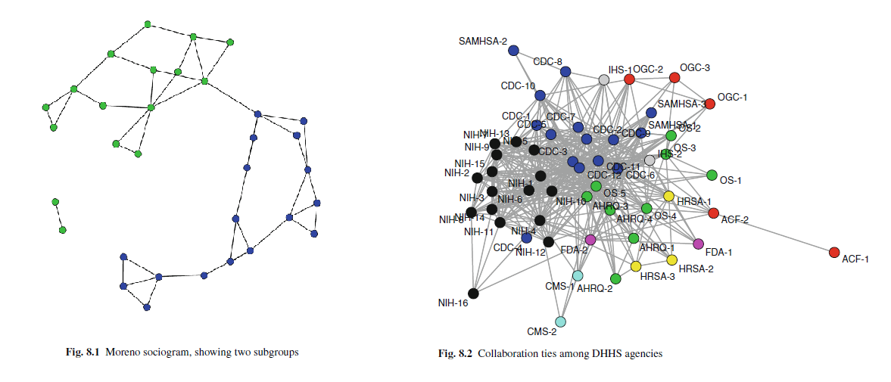
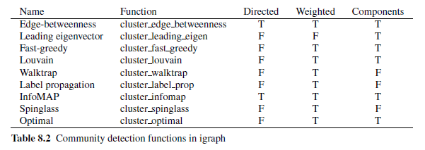

### Librerías necesarias
```{r, warning=FALSE, message=FALSE}
library(igraph)
library(igraphdata)
library(readr)
library(ggplot2)
require(gridExtra)
```

1. David Krackhardt recopiló datos relacionales acerca de la estructura social cognitiva de 21 miembros del personal administrativo de una empresa de fabricación de maquinaria de alta tecnología para evaluar los efectos de una intervención administrativa. Una de las relaciones consultada fue “¿Quién es amigo de X?”. Cada persona indicó no solo sus relaciones de amistad, sino también las relaciones que percibió entre todos los demás empleados, generando una matriz de adyacencia de 21×21 involucrando cada persona en el grupo.

   El conjunto de datos se encuentra disponible en http://vlado.fmf.uni-lj.si/pub/networks/data/ucinet/krackfr.dat. Este archivo contiene la estructura social cognitiva completa de dimensión 21, es decir, veintiuna matrices de adyacencia de 21 × 21, donde la matriz $j$ contiene la percepción del actor $j$ acerca de las relaciones de amistad del sistema social en el que se encuentra inmerso, con $j=1,…,21$. Además, el archivo krackhardt21c.txt contiene información acerca de cada uno de los actores: age (edad en años cumplidos), tenure (tiempo de trabajo en la compañía en años cumplidos), level (cargo; 1: presidente, 2: vicepresidente, 3: gerente) dept (departamento de la compañía en el que trabaja; el presidente no pertenece a ningún departamento).

### Importación de datos
```{r, warning=FALSE}
MAdj<-as.matrix.data.frame(read.table("http://vlado.fmf.uni-lj.si/pub/networks/data/ucinet/krackfr.dat", header = FALSE, sep = " ", skip = 26)[,-1],21,21)

MAdj<-array(t(MAdj),c(21,21,21))

I=21
empl<-c("ACTOR#1","ACTOR#2","ACTOR#3","ACTOR#4","ACTOR#5","ACTOR#6","ACTOR#7","ACTOR#8","ACTOR#9","ACTO#10","ACTOR#11","ACTOR#12","ACTOR#13","ACTOR#14","ACTOR#15","ACTOR#16","ACTOR#17","ACTO#18","ACTOR#19","ACTOR#20","ACTOR#21")

atri <- read_table2("~/2022-2/Redes sociales/Taller 4/krackhardt21c.txt")
```

a. Obtener la red de consenso cuya matriz de adyacencia $\mathbf{Y}=[yi,j]$ está dada por $y_{i,j}=1$ si $\frac{1}{I}\sum_{k=1}^{I}y_{i,j,k}>0.5$ y $y_{i,j}=0$ en otro caso, donde $I$ el número de actores en el sistema, y $y_{i,j,k}$ es la percepción $k$ acerca de la relación entre los actores $i$ y $j$.

```{r}
################# a

#creación matriz de ajyacencia de la red de consenso
MCons<-matrix(0,I,I)

for (i in 1:I){
  MCons=MCons+t(MAdj[,,i])*(1/I)
}

for (i in 1:I) {
  for (j in 1:I) {
    ifelse(MCons[i,j]>0.5, MCons[i,j]<-1, MCons[i,j]<-0)
  }
}
```

b. Hacer visualizaciones no decoradas en un diseño circular de todas las percepciones y de la matriz de consenso. ¿Parece haber diferencias entre las percepciones y entre cada una de las percepciones y la red de consenso?

```{r}
################ b

#creación de grafos matrices de adyacencia y de consenso
Grafos<-NULL

for (i in 1:I) {
  Grafos[[i]]<-graph_from_adjacency_matrix(t(MAdj[,,i]), mode = "directed")
}

Grafos[[22]]<-graph_from_adjacency_matrix(MCons, mode = "directed")

#plots redes
plot_b<-function(red, titulo){
  return(plot(red, layout = layout_in_circle, vertex.size = 10, main = titulo, vertex.color = rep("blue", I), edge.arrow.size = 0.5))
}

par(mfrow=c(1,2))
for (i in 1:(I+1)) {
  V(Grafos[[i]])$label.dist <- 2
  plot_b(Grafos[[i]],c(empl,"Red de consenso")[i])
}
```

Por definición de la matriz de adyacencia de la red de consenso, más del $50%$ de las redes de las percepciones de cada actor van a tener las mismas relaciones que indica el grafo de la red de consenso. De los grafos también se puede observar que el actor 17 se considera a sí mismo el más social y que los actores 3, 6, 8, 9, 18 y 20 son los que menos se fijan en las relaciones que pueden existir dentro de la oficina, por el lado contrario los actores 1, 5, 7, 11, 19 y 21 son los que más sobreestiman las relacoines dentro de la oficina.

c. Calcular el grado (normalizado) para cada actor en cada percepción y el consenso. Para cada actor hacer un diagrama de caja que describa la distribución de su grado a través de todas las percepciones y el consenso. Distinguir con color rojo y un triángulo (△) el grado de acuerdo a su propia percepción y con color azul y una cruz (×) el grado de acuerdo con el consenso. Representar todos los diagramas de caja en un solo gráfico. Un ejemplo de tal gráfico se puede encontrar en https://arxiv.org/pdf/1711.03662.pdf, página 9. ¿Los actores parecen tener una percepción adecuada de su participación en las relaciones del sistema?

```{r}
################# c

# grados normalizados de los vértices por percepción y consenso
grados<-NULL

for (i in 1:I) {
  grados<-rbind(grados, cbind((degree(Grafos[[i]])-mean(degree(Grafos[[i]])))/sd(degree(Grafos[[i]])) , 1:I, rep(i,I)))
}

grados<-rbind(grados, cbind((degree(Grafos[[22]])-mean(degree(Grafos[[22]])))/sd(degree(Grafos[[22]])) , 1:I, rep("consenso",I)))

grados<-as.data.frame(grados)
names(grados)<-c("grado","actor","percepción")

# vector de grados de percepciones de si mismos
sperc<-grados$grado[grados$actor==grados$percepción]
# vector de grados de la red de consenso 
consperc<-grados$grado[grados$percepción=="consenso"]

grados$actor<-factor(grados$actor, levels = 1:I)

#boxplot
boxplot(as.numeric(grado)~actor, data=grados, xlab = "Empleado", ylab = "Grado normalizado" )
points(x=1:I, y=sperc, pch=24, bg="red", cex=.8, col="red")
points(x=1:I, y=consperc, pch=4, col="blue", cex=.8)
```

Los actores tienden a sobreestimar su número de relaciones en la oficina, esto debido a que como se puede observar su grado desde su misma percepción en casi todos los casos, excepto por el actor 4, se encuentra muy por encima del grado que se tiene en consenso sobre ellos por más del 50% de la oficina. Por lo mismo descrito anteriormente el grado de acuerdo a su propia percepción normalmente se encuentra por encima del $50%$ central de los grados desde todas las percepciones, casi siempre siendo un dato atípico, mientras que el grado por consenso está cerca de la mediana indicando que la distribución del grado de esos actores es simétrica.

d. Repetir el numeral anterior para una medida de centralidad de su elección. ¿Los actores parecen tener una percepción adecuada de su participación en las relaciones del sistema? 

```{r}
################## d

# centralidad de cercanía normalizada de los vértices por percepción y consenso
cerc<-NULL

for (i in 1:I) {
  cerc<-rbind(cerc, cbind(closeness(graph = Grafos[[i]], normalized = T) , 1:I, rep(i,I)))
}

cerc<-rbind(cerc, cbind(closeness(graph = Grafos[[22]], normalized = T) , 1:I, rep("consenso",I)))

cerc<-as.data.frame(cerc)
names(cerc)<-c("centralidad","actor","percepción")

# vector de centralidad desde la perspectiva de si mismos
sperc_cerc<-cerc$centralidad[cerc$actor==cerc$percepción]
# vector de centralidad de la red de consenso 
consperc_cerc<-cerc$centralidad[cerc$percepción=="consenso"]

cerc$actor<-factor(cerc$actor, levels = 1:I)

#boxplot
boxplot(as.numeric(centralidad)~actor, data=cerc, xlab = "Empleado", ylab = "Centralidad de cercanía" )
points(x=1:I, y=sperc_cerc, pch=24, bg="red", cex=.8, col="red")
points(x=1:I, y=consperc_cerc, pch=4, col="blue", cex=.8)


```

Considerando la centralidad de cercanía se observa que solo para los actores 8 y 18 esta medida local desde su perspectiva coincide con la de consenso, y como tienen un valor casi iguual, cercano al $0.7$ saben lo importantes que son en las relaciones de la oficina. Para actores tales como el número 1 o 16 se consideran con una importancia en el sistema cuando en realidad no lo afectan ya que su centralidad de cercanía es NA por ser un nodo aislado. Un actor a destacar es el número 7 el cual sabe que no es importante en el sistema al no estar cerca de ningún actor pero los demás empleados lo llegan a considerar importante hasta el punto de que alguien lo considera de lo más importantes del sistema, es decir, un punto de articulación para las relaciones entre la oficina.

e. Calcular la densidad de cada percepción. Representar estos valores por medio de un histograma. Representar con una linea vertical la densidad del consenso. ¿Las percepciones de la densidad de las relaciones están concordancia con el consenso?

```{r}
############## e

dens<-NULL

for (i in 1:I) {
  dens<-rbind(dens, cbind(round(edge_density(graph = Grafos[[i]]),3), i))
}

dens<-rbind(dens, cbind(round(edge_density(graph = Grafos[[22]]),3), "consenso"))

dens<-as.data.frame(dens)
names(dens)<-c("densidad","percepción")

# histograma
hist(as.numeric(dens[-22,1]), main = "Histograma de densidad", 
     xlab = "Densidad", ylab = "Frecuencia",
     col = "lightblue1")
abline(v=as.numeric(dens[22,1]), col=c('royalblue4'), lwd=2)
```

El $71.4\%$ de las percepciones de la densidad del sistema está por encima de la densidad por consenso, cual indica que los empleados tienden a pensar que la oficina es más sociable de lo que en realidad es.

f. Repetir el numeral anterior tanto para la transitividad como para la asortatividad.

```{r}
############## f

trans<-NULL
asort<-NULL

# asignación de atributos a los nodos
for (i in 1:(I+1)) {
  set.vertex.attribute(graph=Grafos[[i]], name="Edad", index=V(Grafos[[i]]), value=atri$age)
  set.vertex.attribute(graph=Grafos[[i]], name="TimeJob", index=V(Grafos[[i]]), value=atri$tenure)
  set.vertex.attribute(graph=Grafos[[i]], name="Cargo", index=V(Grafos[[i]]), value=atri$level)
  set.vertex.attribute(graph=Grafos[[i]], name="Dep", index=V(Grafos[[i]]), value=atri$dept)
}

# transitividad y asortatividad para cada red 
for (i in 1:I) {
  trans<-rbind(trans, cbind(round(transitivity(graph = Grafos[[i]], type="global"),3), i))
  asort<-rbind(asort, cbind(round(assortativity_nominal(graph = Grafos[[i]], types = atri$level, directed = TRUE),3), i))
}

trans<-rbind(trans, cbind(round(transitivity(graph = Grafos[[22]], type="global"),3), "consenso"))
asort<-rbind(asort, cbind(round(assortativity_nominal(graph = Grafos[[22]], types = atri$level, directed = TRUE),3), "consenso"))

trans<-as.data.frame(trans)
asort<-as.data.frame(asort)
names(trans)<-c("transitividad","percepción")
names(asort)<-c("asortatividad","percepción")
trans$percepción<-as.factor(trans$percepción)
asort$percepción<-as.factor(trans$percepción)

# histograma
par(mfrow=c(1,2))

hist(as.numeric(trans[-22,1]), main = "Histograma de la transitividad", 
     xlab = "Transitividad", ylab = "Frecuencia",
     col = "lightblue1")
abline(v=as.numeric(trans[22,1]), col=c('royalblue4'), lwd=2)

hist(as.numeric(asort[-22,1]), main = "Histograma de la asortatividad", 
     xlab = "Asortatividad", ylab = "Frecuencia",
     col = "lightblue1")
abline(v=as.numeric(asort[22,1]), col=c('royalblue4'), lwd=2)

```

Como podemos ver del histograma de la transitividad casi todos los empleados creen que existe cierta transitividad en las amistades de la oficina cuando en realidad esto no pasa. Mientras que en el histograma de la asortatividad la mayoría de las percepciones de las relaciones en la oficina es que aunque los empleados parecidos tienen amistades esto no sucede mucho, aunque la percepción de consenso indica que pasa más a menudo de lo que se piensa.

g. Particionar la red de consenso usando tres métodos de agrupamiento de su elección. Visualizar los resultados obtenidos. Mediante el RI y el RI ajustado comparar las particiones obtenidas con el la partición dada por el departamento al cual pertenecen los empleados.

```{r}
###################### g

# creación de particiones por diferentes métodos
pr<-cluster_label_prop(Grafos[[22]])
eb<-cluster_edge_betweenness(Grafos[[22]])
inf<-cluster_infomap(Grafos[[22]])

V(Grafos[[22]])$label.dist<-0

# mejor visualización del sistema
kk<-layout_with_kk(Grafos[[22]])

#grafos por particiones
par(mfrow=c(1,2))
plot(Grafos[[22]], layout=kk, vertex.size = 16, edge.color = "black", vertex.color=atri$dept, edge.arrow.size = 0.2, main="Partición del departamento", cex.main=0.5)
plot(Grafos[[22]], layout=kk, vertex.size = 16, edge.color = "black", vertex.color=pr$membership, edge.arrow.size = 0.2, main="Partición Label propagation", cex.main=0.5)
plot(Grafos[[22]], layout=kk, vertex.size = 16, edge.color = "black", vertex.color=eb$membership, edge.arrow.size = 0.2, main="Partición Edge-betweenness", cex.main=0.5)
plot(Grafos[[22]], layout=kk, vertex.size = 16, edge.color = "black", vertex.color=inf$membership, edge.arrow.size = 0.2, main="Partición InfoMAP", cex.main=0.5)

```

```{r}
# comparación de particiones mediante el RI y el RI ajustado
comp<-as.data.frame(rbind(c(compare(atri$dept, pr$membership, method="rand"), compare(atri$dept, pr$membership, method="adjusted.rand")), c(compare(atri$dept, eb$membership, method="rand"), compare(atri$dept, eb$membership, method="adjusted.rand")), c(compare(atri$dept, inf$membership, method="rand"), compare(atri$dept, inf$membership, method="adjusted.rand"))))

names(comp)<-c("RI","RI adj")
rownames(comp)<-c("Label propagation", "Edge-betweenness", "InfoMAP")

comp
```

Como podemos ver la partición por medio de Edge-betweenness e InfoMAP es la misma y además la partición por Label propagation es la mejor porque es la que tiene el RI y RI ajustado mayor, lo cual indica que es el método que induce una partición más parecida a la dada por el departamento

2. Considere la base de datos relacionales de su interés que reportó en el numeral 8. del Taller 2.

```{r, message=FALSE}
# importación de datos
edges <- read_delim("edges.txt", 
                    delim = "\t", escape_double = FALSE, 
                    trim_ws = TRUE)
nodes <- read_delim("nodes.txt", 
                    delim = "\t", escape_double = FALSE, 
                    trim_ws = TRUE)

#creación de grafo
usagency<-graph_from_data_frame(edges[,c(1,2)], directed = TRUE, vertices = nodes$NodeId)

#añadir número de hiperlinks en cada relación
set.edge.attribute(graph = usagency, name = "LinkCount", value = edges$LinkCount, index = E(usagency))
```

a. Particionar la red de consenso usando tres métodos de agrupamiento de su elección. Visualizar los resultados obtenidos.

```{r}
################ a

# creación de particiones por diferentes métodos
pr<-cluster_label_prop(usagency)
eb<-cluster_edge_betweenness(usagency)
inf<-cluster_infomap(usagency)

# mejor visualización del sistema
kk<-layout_with_kk(usagency)

# grafos
plot(usagency, layout=kk, vertex.label=NA, vertex.size = 4, edge.color = "black", vertex.color=pr$membership, edge.arrow.size = 0.2, main="Partición Label propagation", cex.main=0.2)
plot(usagency, layout=kk, vertex.label=NA, vertex.size = 4, edge.color = "black", vertex.color=eb$membership, edge.arrow.size = 0.2, main="Partición Edge-betweenness", cex.main=0.2)
plot(usagency, layout=kk, vertex.label=NA, vertex.size = 4, edge.color = "black", vertex.color=inf$membership, edge.arrow.size = 0.2, main="Partición InfoMAP", cex.main=0.2)
```

b. Hacer un análisis de asortatividad de la red.

```{r}
assortativity_degree(graph = usagency, directed = TRUE)
```
El grado de cada entidad indica entre cuales páginas web hay hiperlinks, sin embargo al no ser muy grande solo indica que pocas veces cuando hay una relación entre páginas web de entidades gubernamentales debe ser entre páginas que tengan hiperlinks hacia un número parecido de entidades diferentes.

c. Interpretar los resultados.

```{r}
edge_density(usagency)
pr$modularity
modularity(eb)
inf$modularity
length(table(inf$membership))
```
Como vemos aunque no es una red muy densa por la gran cantidad de nodos (2169) de donde la modularidad de las agrupaciones realizadas con los diferentes algoritmos no son muy grandes, sin embargo vemos que el algoritmo InfoMAP es el que mejor describe los subgrupos de la red con 121 subgrupos. Por lo que la aproximación más exacta indica que hay 121 subgrupos de páginas gubernamentales según sus conexiones por medio de hiperlinks.


3. Sintetizar y replicar el Cap. 8 de Luke, D. A. (2015).

# Subgrupos

Los sistemas sociales representados por medio de redes a menudo son estructuras muy complejas por lo que Granovetter (1973) propuso que estas redes estaban conformadas por subgrupos distinguibles los cuales son densamente conectados dentro y debilmente conectados entre. Se utiliza el paquete igraph para identificar y examinar estos subgrupos


Como vemos de la figura 1 se ven dos grupos principales en la red, sin embargo en la vida real esto no se ve tan claramente, se tienen casos como el de la figura 2 en que aunque hay un indicio de una estructura de subgrupos se necesita un análisis más sistemático para confirmarlo.

## 1. Cohesión social
### 1.1 Clanes

Los clanes son subgrafos completos maximalmente, es decir, un subconjunto de nodos que tienen todas las posibles conexiones entre ellos.

Veamos un ejemplo
```{r}
clqexmp <- graph.formula(A:B:C:D--A:B:C:D,D-E,E-F-G-E)
set.seed(13)
plot(clqexmp, vertex.color="skyblue", vertex.size=15, vertex.label.size=0.1)
```
Hay dos clanes en el grafo, A,B,C,D y E,F,G (normalmente solo los clanes de tamaño 3 o más son de interés). Para conseguir información de los clanes se utilizan los siguientes comandos 

* ***clique.number()***: tamaño del clan más grande
```{r}
clique.number(clqexmp)
```
* ***cliques()***: listado de todos los clanes en el grafo, para indicar que tome los de cierto tamaño se pone el comando $min=$ o $max=$
```{r}
cliques(clqexmp, min = 3)
```
* ***maximal.cliques()***: cuando hay muchos clanes este es más útil ya que devuelve los clanes  que no están incluido en otro
```{r}
maximal.cliques(clqexmp, min = 3)
```
* ***largest.cliques()***: devuelve el clan más grande
```{r}
largest.cliques(clqexmp)
```

La desventaja de los clanes es que son una definición muy consevadora de un subgrupo cohesivo ya que la densidad dentro de cada clan debe ser de 1, sin embargo valores cercanos a 1 también indican la existencia de un subgrupo cohesivo. Además los clanes no son muy comunes en redes sociales muy grandes lo cual se demuestra en las siguientes simulaciones 

```{r}
# simulaciones de redes
g25 <- erdos.renyi.game(25, 75, type="gnm")
g50 <- erdos.renyi.game(50, 150, type="gnm")
g100 <- erdos.renyi.game(100, 300, type="gnm")
g500 <- erdos.renyi.game(500, 1500, type="gnm")

# número de nodos para cada red
nodes <- c(25,50,100,500)

# tamaño del clan más grande para cada red
lrgclq <- c(clique.number(g25),clique.number(g50),
clique.number(g100),clique.number(g500))

# número de clanes con mínimo 3 nodos 
numclq <- c(length(cliques(g25,min=3)),
length(cliques(g50,min=3)),length(cliques(g100,min=3)),
length(cliques(g500,min=3)))

# tabla resumen
clqinfo <- data.frame(Nodes=nodes,Largest=lrgclq,
Number=numclq)
clqinfo
```

### 1.2 K-núcleos

Debido a la rareza de los clanes en las redes sociales observadas se hace una modificación a la definición de clan en la que ahora cada vertice está conectado con al menos otros k vertices en el subgrafo, a esto se le conoce como **k-núcleo**, los cuales son anidados, no se sobreponen y son fáciles de indentificar.

Como ejemplo se considera la red del conjunto de datos DHHS cuyas conexiones están categorizadas según el nivel de conexión entre dos individuos, siendo 1 que solo comparten información y 4 que han hecho colaboraciones formales en múltiples proyectos, por lo que solo se van a considerar las colaboraciones formales en el análisis para tener una red la mitad de densa que la original.

```{r}
remotes::install_github("DougLuke/UserNetR")
library(UserNetR)
data(DHHS)

library(intergraph)

iDHHS <- asIgraph(DHHS)
graph.density(iDHHS)
```
```{r}
iDHHS <- subgraph.edges(iDHHS,E(iDHHS)[collab > 2])
graph.density(iDHHS)
```

* ***graph.coreness()***: regresa un vector con el listado del mayor núcleo al que cada nodo pertenece

```{r}
coreness <- graph.coreness(iDHHS)
table(coreness)

maxCoreness <- max(coreness)
maxCoreness
```

Ahora se grafica la red para evidenciar estos k-núcleos

```{r}
# se selecciona el vector de nombres de cada vértice
Vname <- get.vertex.attribute(iDHHS,name='vertex.names', index=V(iDHHS))
V(iDHHS)$name <- Vname
V(iDHHS)$color <- coreness + 1
op <- par(mar = rep(0, 4))
set.seed(123)
plot(iDHHS,vertex.label.cex=0.8)
par(op)
```

```{r}
# grafo con el valor del k-núcleo al que pertenece como label
colors <- rainbow(maxCoreness)
op <- par(mar = rep(0, 4))
set.seed(123)
plot(iDHHS,vertex.label=coreness,vertex.color=colors[coreness])
par(op)
```
De donde el centro de la red está conformado principalmente por los k-núcleos más grandes. Para examinar los patrones de subgrupos se van eliminando los k-núcleos menores uno a uno

```{r}
V(iDHHS)$name <- coreness
V(iDHHS)$color <- colors[coreness]
iDHHS1_6 <- iDHHS
iDHHS2_6 <- induced.subgraph(iDHHS,vids=which(coreness > 1))
iDHHS3_6 <- induced.subgraph(iDHHS,vids=which(coreness > 2))
iDHHS4_6 <- induced.subgraph(iDHHS,vids=which(coreness > 3))
iDHHS5_6 <- induced.subgraph(iDHHS,vids=which(coreness > 4))
iDHHS6_6 <- induced.subgraph(iDHHS,vids=which(coreness > 5))

lay <- layout.fruchterman.reingold(iDHHS)
op <- par(mfrow=c(3,2),mar = c(3,0,2,0))
set.seed(123)
plot(iDHHS1_6,layout=lay,main="All k-cores")
set.seed(123)
plot(iDHHS2_6,layout=lay[which(coreness > 1),],main="k-cores 2-6")
set.seed(123)
plot(iDHHS3_6,layout=lay[which(coreness > 2),],main="k-cores 3-6")
set.seed(123)
plot(iDHHS4_6,layout=lay[which(coreness > 3),],main="k-cores 4-6")
set.seed(123)
plot(iDHHS5_6,layout=lay[which(coreness > 4),],main="k-cores 5-6")
set.seed(123)
plot(iDHHS6_6,layout=lay[which(coreness > 5),],main="k-cores 6-6")
par(op)
```

## 2. Detección de comunidades

Los clanes y k-núcleos se basan solamente en el patrón de lazos internos que definen a los grupos particulares, sin embargo hay muchos más algoritmos para identificar grupos no solo por los lazos internos, sino también por el patrón de lazos entre diferentes grupos, es decir, un subgrupo en una red es un conjunto de nodos que tiene una gran densidad dentro y pocas conexiones del grupo a otras partes de la red. Estos a veces se denominan algoritmos de detección de comunidades.

### 2.1 Modularidad

Una característica importante de una red que se utiliza en muchos algoritmos de detección de comunidades es el de la **modularidad**. La modularidad es una medida estructural de la red, para la cual los nodos exhiben agrupamiento donde hay mayor densidad dentro de los conglomerados y menor densidad entre ellos (Newman 2006). 
En el ámbito exploratorio un algoritmo maximiza la modularidad y devuelve la clasificación de los nodos que explica mejor el agrupamiento observado. Mientras que en el ámbito descriptivo la estadística de modularidad se calcula para cualquier clasificación de nodos de interés.

La modularidad es una estadística corregida por el azar definida como la fracción de conexiones dentro de los grupos dados menos la fracción esperada si los conexiones fueran distribuidos al azar. Esta estadística puede variar de $−1/2$ a $+1$, entre más cerca de 1 la red muestra un agrupamiento más cercano con respecto al agrupamiento de los nodos dado.

Considerando una red con nueve nodos, se tienen dos atributos categóricos de vértice que clasifican cada uno de los nodos en tres grupos.

```{r}
g1 <- graph.formula(A-B-C-A,D-E-F-D,G-H-I-G,A-D-G-A)
V(g1)$grp_good <- c(1,1,1,2,2,2,3,3,3)
V(g1)$grp_bad <- c(1,2,3,2,3,1,3,1,2)

op <- par(mfrow=c(1,2))
set.seed(123)
plot(g1,vertex.color=(V(g1)$grp_good), vertex.size=20, main="Good Grouping")
set.seed(123)
plot(g1,vertex.color=(V(g1)$grp_bad), vertex.size=20,
main="Bad Grouping")
par(op)
```
```{r}
modularity(g1,V(g1)$grp_good)
modularity(g1,V(g1)$grp_bad)
```

Las redes sociales de la vida real a menudo se caracterizan por una agrupación, pero es más difícil juzgar el alcance de la agrupación a simple vista.

```{r}
library(intergraph)

# se carga la red
data(DHHS)
iDHHS <- asIgraph(DHHS)

# número de nodos por agencia
table(V(iDHHS)$agency)

# agencia de los primeros 10 nodos
V(iDHHS)[1:10]$agency

#modularidad 
modularity(iDHHS,(V(iDHHS)$agency+1))
```

La función ***modularity*** espera que la variable de agrupación esté numerada comenzando en 1 (la versión actual de la función fallará si la el vector de pertenencia a una comunidad tiene 0). 

La modularidad 0,14 sugiere que la agencia DHHS sí explica algunos de los agrupamientos que están presentes
en la red, pero el número tiene poco significado. 
La interpretación de la característica de la red es más significativa si se compara con otra medida relevante.

### 2.2 Algoritmos de detección de comunidades


Para encontrar las comunidades en **igraph** se utiliza una de las funciones descritas en la tabla 8.2 y se almacenan los resultados en un objeto de clase de communities, luego para explorar las comunidades se analiza dicho objeto.

Por ejemplo, se considera la red de amistad de Moreno que está claramente dividida en dos subgrupos según el sexo.

```{r}
data(Moreno)
iMoreno <- asIgraph(Moreno)

# número de nodos por género
table(V(iMoreno)$gender)

# modularidad según el género
modularity(iMoreno,V(iMoreno)$gender)

# Agrupación y su modularidad
cw <- cluster_walktrap(iMoreno)
membership(cw)
modularity(cw)
```

La modularidad del algoritmo es bastante alta, por lo que el algoritmo walktrap ha hecho una mejor detección de la estructura del subgrupo que la agrupación por género. El vector de pertenencia a un subgrupo indica que hay seis diferentes subgrupos. Estos se entiende mejor a través de la visualización.

```{r}
set.seed(123)
plot(cw, iMoreno)
```

```{r}
cw <- cluster_walktrap(iDHHS)
modularity(cw)
membership(cw)
table(V(iDHHS)$agency,membership(cw))
```

Una práctica común es usar más de un algoritmo de detección de comunidades y comparar los resultados.
***Solo algunos algoritmos soportan cierto tipo de redes como las dirigidas***
Considerando el ejemplo del terrorismo en Bali, se utilizan diferentes algoritmos para encontrar diferentes subgrupos.

```{r}
data(Bali)
iBali <- asIgraph(Bali)

cw <- cluster_walktrap(iBali)
modularity(cw)
membership(cw)

ceb <- cluster_edge_betweenness(iBali)
modularity(ceb)
membership(ceb)

cs <- cluster_spinglass(iBali)
modularity(cs)
membership(cs)

cfg <- cluster_fast_greedy(iBali)
modularity(cfg)
membership(cfg)

clp <- cluster_label_prop(iBali)
modularity(clp)
membership(clp)

cle <- cluster_leading_eigen(iBali)
modularity(cle)
membership(cle)

cl <- cluster_louvain(iBali)
modularity(cl)
membership(cl)

co <- cluster_optimal(iBali)
modularity(co)
membership(co)
```

Lo cual indica que todos los algoritmos identifican $2$ o $3$ subgrupos, donde la modularidad va desde $0.24$ hasta $0.30$.
Las detecciones de comunidades pueden ser comparadas entre si por medio de métricas de comparación de clasificación como el estadístico de Rand ajustado. 

```{r}
table(V(iBali)$role,membership(cw))

compare(as.numeric(factor(V(iBali)$role)),cw,
method="adjusted.rand")

compare(cw,ceb,method="adjusted.rand")

compare(cw,cs,method="adjusted.rand")

compare(cw,cfg,method="adjusted.rand")
```

```{r}
op <- par(mfrow=c(3,2),mar=c(3,0,2,0))
set.seed(123)
plot(ceb, iBali,vertex.label=V(iBali)$role, main="Edge Betweenness")
set.seed(123)
plot(cfg, iBali,vertex.label=V(iBali)$role, main="Fastgreedy")
set.seed(123)
plot(clp, iBali,vertex.label=V(iBali)$role, main="Label Propagation")
set.seed(123)
plot(cle, iBali,vertex.label=V(iBali)$role, main="Leading Eigenvector")
set.seed(123)
plot(cs, iBali,vertex.label=V(iBali)$role, main="Spinglass")
set.seed(123)
plot(cw, iBali,vertex.label=V(iBali)$role, main="Walktrap")
par(op)
```